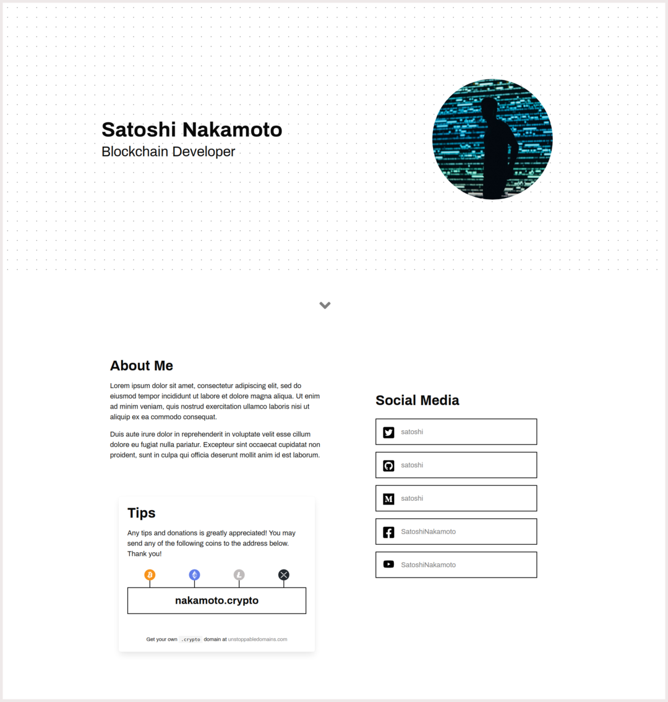

# Decentralized Website Template: "Personal Minimalist"

This is a decentralized website template, ready to be deployed to IPFS on your
unstoppable .crypto domain.

Contains "About Me", "Social Links" and "Tips" sections. The "Tips" section
can be used to solicit donations or tips, displaying your .crypto domain
and accepted crypto currencies.

The default list of accepted currencies are: `BTC` `BCH` `ETH` `LTC` `XRP` `USDT`

Also contains a small paragraph to prompt the visitor to register their own
.crypto domain (_NOTE:_ this link contains the template author's referral
code. You may change or remove the code as you see fit).

## For advanced template customization

Template SASS source code can be found at a seperate repository:

https://github.com/zzzaim/personal-minimalist-template

